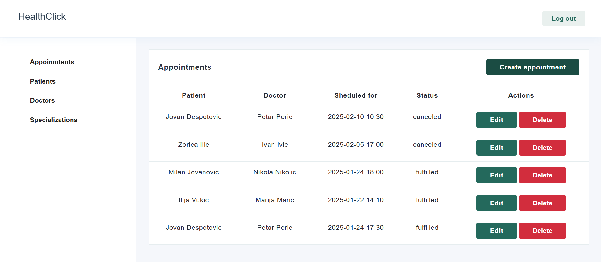

# HealthClick

## Description

Full-stack demo application designed to support the work of clinics, medical offices, and health centers.

Initially, the application was built as a monolithic API using TypeScript (Node.js). Later, the project evolved to demonstrate proficiency in microservices architecture, Docker, and Kubernetes.

While a Vue.js frontend was also developed for the application, the primary focus of this demo is on the backend architecture and demonstrating modern development practices for scalable and maintainable systems.

## Functionality

Authorization (with JWT):

1. Register,
2. Login,
3. Logout

When you are not authorized you can:

1. Appointments - create, list, get details, update and delete,
2. Patients - create, list, get details, update, delete,
3. Doctors - create, list, get details, update, delete,
4. Specializations - create, list, get details, update, delete

## Demo

You can check my application [here](http://hospital-manager-app.s3-website.eu-central-1.amazonaws.com/).

## Appointments page

